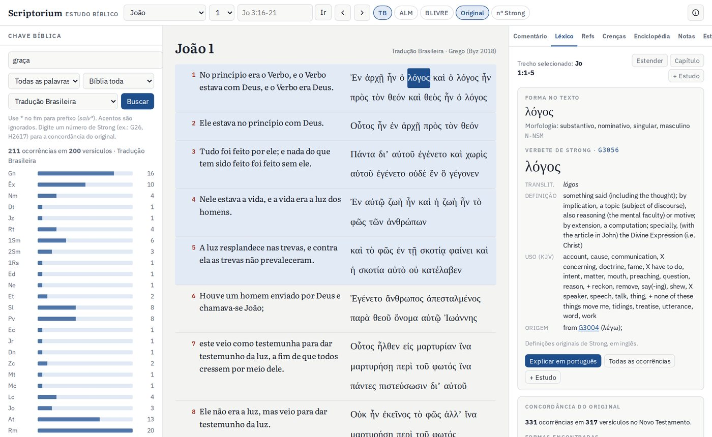

# Scriptorium Bíblico

Ferramenta de estudo sistemático da Bíblia em português, feita para celular e computador e instalável como aplicativo (PWA).

## Recursos

- **Texto bíblico:** Tradução Brasileira, Almeida 1911 e Bíblia Livre, lado a lado
- **Original:** hebraico (Westminster Leningrad Codex) e grego (Texto Bizantino), com números de Strong e morfologia em português
- **Léxico:** dicionários hebraico e grego de Strong, com a concordância completa de cada palavra
- **Chave bíblica:** busca por palavra, frase, prefixo ou número de Strong, com distribuição por livro
- **Referências cruzadas:** cerca de 180 mil ligações entre textos
- **Comentário com IA (opcional):** exegético, histórico-cultural, teológico, devocional, esboço de sermão e perguntas livres
- **Leitura adventista:** 355 capítulos de Ellen G. White ligados às passagens, com as 28 Crenças Fundamentais
- **Enciclopédia bíblica** com 119 verbetes
- **Notas e estudos:** monte um estudo e exporte em PDF ou Word
- **Uso offline** e backup das anotações

## Como usar

- Manual do usuário: [`manual.html`](manual.html) ou [`docs/Scriptorium-Manual.pdf`](docs/Scriptorium-Manual.pdf)
- Guia de publicação e ativação da IA: [`docs/publicacao.html`](docs/publicacao.html)

## Publicar com o GitHub Pages

1. Em **Settings → Pages**, escolha **Deploy from a branch**, branch `main`, pasta `/ (root)`.
2. O app ficará em `https://SEU-USUARIO.github.io/scriptorium-biblico/`.
3. Para a IA, siga o guia em `docs/publicacao.html`. Em `ALLOWED_ORIGIN`, use `https://SEU-USUARIO.github.io`, sem o nome do repositório.

## Estrutura

| Caminho | Conteúdo |
|---|---|
| `index.html` | O aplicativo |
| `config.js` | Endereço do servidor da IA (único arquivo a configurar) |
| `sw.js`, `manifest.webmanifest`, `icons/` | Instalação e funcionamento offline |
| `data/` | Bíblias, textos originais, léxicos, referências, enciclopédia e índice adventista |
| `lib/`, `fonts/` | Bibliotecas de exportação (jsPDF, docx) e fonte FreeSerif |
| `servidor-ia/worker.js` | Servidor da IA para Cloudflare Workers. A chave da API fica só na Cloudflare, nunca neste repositório |

## Fontes e licenças dos dados

| Conteúdo | Fonte | Licença |
|---|---|---|
| Tradução Brasileira, Almeida 1911 | — | Domínio público |
| Bíblia Livre | Diego Santos | CC BY |
| Hebraico com lemas e morfologia | Open Scriptures Hebrew Bible / WLC | CC BY 4.0 |
| Grego com Strong e morfologia | Robinson-Pierpont, Texto Bizantino 2018 | Domínio público |
| Dicionários de Strong | Open Scriptures | CC BY-SA |
| Referências cruzadas | OpenBible.info | CC BY |
| Fonte FreeSerif | GNU FreeFont | GPL com exceção para fontes |
| jsPDF / docx | — | MIT |

Os arquivos `data/lex_heb.json` e `data/lex_grk.json` derivam dos dicionários de Strong da Open Scriptures e continuam sob CC BY-SA.

As introduções aos livros, a enciclopédia, os resumos das crenças e o índice de Ellen G. White foram escritos para este projeto. Os livros de Ellen G. White são acessados pelos PDFs oficiais do Centro de Pesquisas Ellen G. White. *Nisto Cremos*, o *Tratado de Teologia Adventista* e o *Comentário Bíblico Adventista* são citados apenas como referência de leitura.

> “Examinai as Escrituras… e são elas mesmas que testificam de mim.” (Jo 5:39)
